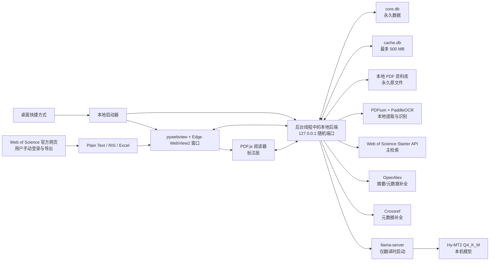
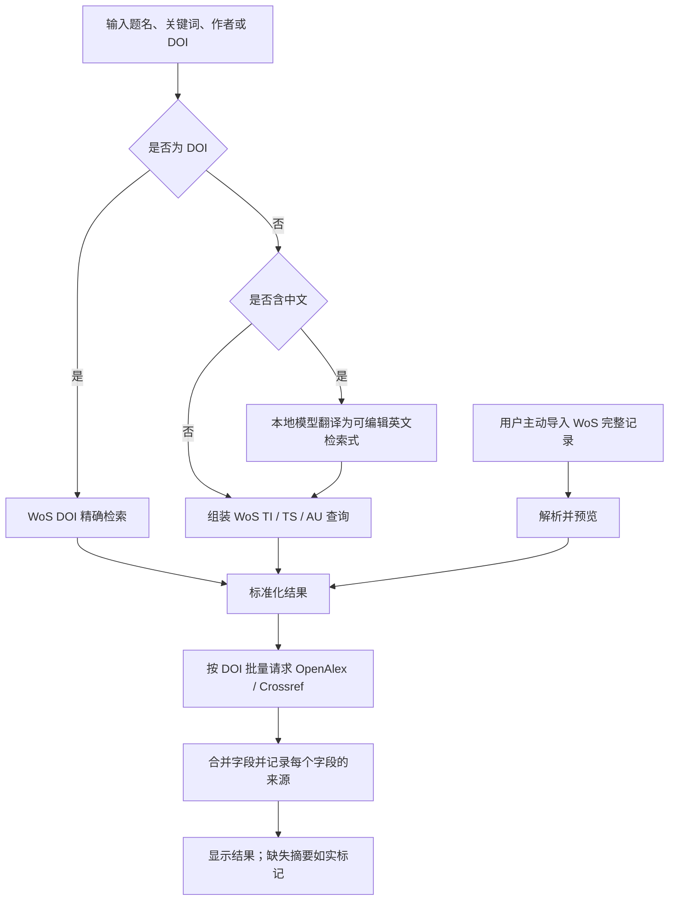

# 文献管理器技术设计（V1 实现基线）

版本：V1.3
初版日期：2026-08-05
实现状态更新：2026-08-06
状态：已实现；产品范围以 `PRD.md` 为准，验证结果见 `IMPLEMENTATION_STATUS.md`

## 1. 已确认前提

- App 只供本人在一台 Windows 电脑上使用，不做账户、多用户、云同步和管理后台。
- 界面在 pywebview 承载的 Microsoft Edge WebView2 独立窗口中打开；通过桌面快捷方式启动。
- 本地后台只在 App 使用期间运行。关闭 App 窗口后，后台安全退出；页面心跳空闲退出只作为异常兜底。
- 偏好、收藏、文献、已保存译文、标签和笔记必须保存在本机，刷新、关闭窗口、重启 App 或电脑后均不能丢失。
- 可以联网，但只使用免费额度或免费的外部服务；程序不得自动产生任何付费调用。
- Web of Science 是主检索源；OpenAlex、Crossref 等免费开放接口只做元数据/摘要补全与故障降级。
- 不模拟学校登录、不抓取 Web of Science 网页、不绕过验证码、订阅或付费墙。
- 支持用户本人在 Web of Science 正常登录后，通过官方导出功能取得完整记录，再将导出文件手动导入 App。
- 本地翻译使用 `Tencent Hy-MT2-1.8B GGUF Q4_K_M`；V1 不做 AI 快速理解、摘要生成或全文问答。
- 支持用户主动上传 PDF，将原文件永久保存在本机知识库中；不自动从出版社或数据库下载全文。
- PDF 阅读器支持高亮、划线和批注，标注作为知识库笔记保存，但不改写或导出到原始 PDF。
- 普通 PDF 直接提取文字；扫描版、图片型或混合 PDF 使用本地 OCR，不把 PDF 上传到外部服务。
- 自动备份不包含 PDF 原文件，PDF 需由用户自行另行备份。
- 可删除缓存上限为 500 MB；翻译模型、数据库中的个人资料和备份不计入缓存。

## 2. 方案结论

V1 采用“WebView2 独立窗口 + 本地后端 + 本地数据库 + 按需翻译进程”的结构。



这不是一个一直驻留在系统里的服务。快捷方式在后台线程启动本地后端，并在主线程打开独立 WebView2 窗口。用户关闭窗口时，启动器立即请求后台完成写入并安全退出；页面心跳与 2 分钟空闲等待只在窗口渲染进程异常消失时兜底。翻译进程是后台的子进程，后台退出时也必须退出。

## 3. 建议技术栈

| 层 | 选择 | 原因 |
|---|---|---|
| 页面 | React + TypeScript + Vite | 适合已经确认的桌面型页面、筛选器、详情页和大量交互状态；类型检查可减少数据字段混乱 |
| 本地接口 | Python + FastAPI | 适合接入文献 API、SQLite、任务调度和本地模型；后续可打包为 Windows 可执行程序 |
| 桌面窗口 | pywebview 6.2.1 + Edge WebView2 | 提供无地址栏的独立窗口、窗口生命周期与系统浏览器外链 |
| 本地数据库 | SQLite + FTS5 | 不需要安装数据库服务；一个文件即可保存核心数据；FTS5 可检索标题、摘要、译文、标签和笔记 |
| PDF 阅读器 | Mozilla PDF.js | WebView2 窗口内完成页面渲染、文本选择、缩放、目录和文内搜索；使用自定义标注层保存 App 内高亮与批注 |
| PDF 解析/渲染 | pypdfium2 / PDFium | 后端可提取普通 PDF 的文本和坐标，也可将扫描页渲染为 OCR 输入；采用不带 V8/XFA 的构建 |
| 扫描件识别 | PaddleOCR PP-OCRv6 本地管线 | 支持中文、英文等多语种与 Windows CPU；返回文本和坐标，供摘要提取、搜索和标注使用 |
| 翻译运行器 | llama.cpp 的 `llama-server` | 原生支持 GGUF 和 Windows，可只监听本机地址，并提供本地 HTTP 接口 |
| Windows 打包 | PyInstaller 或同类单文件启动器 | 最终让用户通过桌面快捷方式使用，不要求手动运行命令 |

前端构建后的静态文件由本地后端直接提供，所以正式使用时不会同时启动两个开发服务器。

## 4. App 启动与退出

### 4.1 启动

1. 用户双击桌面快捷方式。
2. 启动器先检查 App 是否已经运行；已经运行时恢复并聚焦已有窗口。
3. 未运行时，在 `127.0.0.1` 上选择一个可用随机端口，并在后台线程启动后端。
4. 后端完成数据库检查和过期任务登记后，在主线程创建 WebView2 窗口。
5. WebView2 页面使用一次性启动码换取仅本次运行有效的会话 Cookie，随后从内部 URL 移除启动码。

不固定使用 3000、8000 等端口，以减少端口冲突。后端只绑定 `127.0.0.1`，局域网里的其他设备不能访问。

### 4.2 判断窗口页面是否仍然在线

- 窗口页面生成独立 `tab_id`，每 15 秒发送一次心跳。
- 页面卸载时用 `sendBeacon` 主动报告；该信号和心跳是 WebView2 渲染进程异常时的兜底依据。
- 45 秒没有页面心跳，就认为渲染页面已经离开。
- 窗口关闭事件未到达且有效页面数量为 0 时，进入 2 分钟空闲倒计时。
- 倒计时期间窗口恢复或重新打开 App，立即取消退出。

### 4.3 安全退出

- 正常关闭 App 窗口时，启动器立即请求后端安全退出；若没有正在写数据库、复制 PDF、OCR 或翻译的任务，执行数据库检查点并退出。
- WebView2 渲染进程异常消失时，心跳失效后的倒计时执行相同的兜底退出流程。
- 若任务正在执行，停止接收新后台任务，等待当前文件复制或数据库小事务完成后退出；OCR 和翻译可保存进度、取消并在下次启动后重试。
- 使用 Windows 作业对象或等效父子进程约束，保证后端异常退出后 `llama-server` 不会单独残留。
- App 关闭期间不会抓取新文献、检查保存搜索或发送通知；下次打开时补做已经到期的检查。

## 5. 本机文件与空间控制

建议数据目录为：

```text
%LOCALAPPDATA%\CatalystLiterature\
├─ data\
│  ├─ core.db                 永久数据
│  └─ cache.db                可删除缓存，硬上限 500 MB
├─ library\
│  └─ pdfs\                   用户上传的 PDF 原文件，不自动清理
├─ models\
│  ├─ Hy-MT2-1.8B-Q4_K_M.gguf
│  └─ ocr\                    本地 OCR 模型
├─ runtime\
│  └─ llama-server.exe
├─ backups\                  本地备份
└─ logs\                     滚动日志
```

### 5.1 永久数据与缓存分离

`core.db` 保存用户明确拥有或要求保留的内容：

- 研究偏好和设置；
- 收藏、知识库、标签、笔记和阅读状态；
- 喜欢、不感兴趣及屏蔽记录；
- 已保存的文献元数据、来源记录和译文；
- PDF 文件索引、提取出的题目/摘要以及所有阅读标注；
- 保存的搜索、订阅规则及其上次检查时间。

这些内容不会被缓存清理功能删除，也不设置自动容量上限。用户上传的 PDF 原文件存放在 `library\pdfs`，同样属于永久资料；数据库只保存其哈希、相对路径和文献关联，不把大文件塞进 SQLite。

`cache.db` 只保存可以再次从网络或模型获得的内容：

- 尚未收藏或操作的搜索结果；
- 外部接口的短期响应；
- 推荐候选列表；
- 没有保存的临时译文；
- PDF 页面缩略图、临时渲染图片和可重新生成的 OCR 页面索引；
- 搜索建议和临时统计。

一篇文献一旦被收藏、喜欢、不感兴趣、加笔记或明确保存译文，相关数据立即从缓存“提升”到核心数据库。

### 5.2 500 MB 缓存规则

- 正常目标：450 MB 以下；硬上限：500 MB。
- 每次写缓存前检查预计大小；超过目标后按“最久未使用”分批清理。
- 优先删除过期搜索响应，再删除推荐候选和 PDF 临时渲染结果，最后删除未保存的临时译文。
- 搜索/API 缓存默认保留 7 天；未保存译文默认保留 90 天。
- `cache.db` 从创建时启用增量空间回收，清理后逐步归还磁盘空间，不自动执行可能临时占用双倍空间的完整 `VACUUM`。
- 设置页分别显示核心数据、PDF 资料库、缓存、模型、备份和日志占用；“安全清理”只碰缓存和日志，绝不删除 `library\pdfs`。
- 日志不记录 API Key、摘要全文或笔记正文，默认滚动保留不超过 20 MB。

### 5.3 备份

- 自动备份只包含 `core.db` 和必要配置，不包含 PDF 原文件、缓存、模型和运行程序。
- 使用 SQLite 在线备份能力生成一致快照；备份完成后做完整性检查，再原子改名为正式备份文件。
- 默认保留最近 10 份自动备份；用户手动创建的备份不自动删除。
- 恢复前先给当前数据库生成一次保护性备份。
- 因为 PDF 不在备份中，从备份恢复后若原 PDF 目录不存在，文献和标注记录仍保留，但阅读器显示“原文件缺失”；用户可重新选择同一 PDF，哈希一致后自动恢复关联。

SQLite 官方说明 WAL 允许读取与写入并发，并会通过检查点控制 WAL 文件；官方还披露了已在 3.51.3 修复的低概率 WAL 并发缺陷。因此实现时必须使用 SQLite 3.51.3 或更高版本，并在空闲和退出前主动检查点。参考：[SQLite WAL](https://sqlite.org/wal.html)、[SQLite Backup API](https://sqlite.org/backup.html)、[SQLite FTS5](https://sqlite.org/fts5.html)。

## 6. 文献数据三通道

### 6.1 自动主通道：Web of Science Starter API

Web of Science 负责“检索结果是谁、是否属于 WoS、题名/作者/来源/DOI 等基础信息”。检索优先使用 `WOS` 数据库；界面显示本次调用来源和剩余额度状态。

已核实的限制：

- Starter API 需要在 Clarivate Developer Portal 注册应用并配置 API Key。
- 普通免费计划为 50 次/天、1 次/秒；学校机构成员免费计划最高 5,000 次/天、5 次/秒，实际权限以申请结果为准。
- 每个检索请求最多返回 50 条。
- `TS` 可在题名、摘要、作者关键词和 Keywords Plus 中检索，但 Starter 返回字段列表中没有摘要正文。

因此，“WoS 检索 + 直接从同一接口得到摘要”不可行。正确做法是先用 WoS 找到文献，再用 DOI 去开放来源补全摘要。参考：[Web of Science Starter API 计划](https://developer.clarivate.com/apis/wos-starter)、[Starter API Swagger](https://developer.clarivate.com/apis/wos-starter/swagger)。

### 6.2 自动补全通道

补全顺序如下：

1. OpenAlex 按 DOI 批量匹配，读取开放元数据及其提供的 `abstract_inverted_index`，在本机还原为摘要文本。
2. OpenAlex 没有摘要时，用 Crossref DOI 接口补全出版元数据以及成员提交的摘要。
3. 两者都没有摘要时，详情页明确显示“当前开放来源未提供摘要”，同时保留 WoS 和 DOI 原始页面入口。
4. V1 不抓取出版社网页。以后只可针对有公开文档、许可和稳定接口的出版社增加独立适配器。

OpenAlex 现在要求免费 API Key；免费 Key 每日含 1 美元 API 用量。程序只使用当日免费额度，读取额度响应头，在额度接近用尽时停止调用，绝不自动充值或使用付费余额。按 DOI 的单条查询目前免费，批量 OR 查询最多 100 个值；列表每页最多 100 条。参考：[OpenAlex 认证与计费](https://developers.openalex.org/api-reference/authentication)、[OpenAlex Works](https://developers.openalex.org/api-reference/works/list-works)。

Crossref 公共 REST API 不要求付费 Key。程序提供一个联系邮箱设置并使用 polite 方式访问，遵守响应头中的限流；当前 polite 池为 10 次/秒、最多 3 个并发，遇到 429 时指数退避。Crossref 摘要并非每篇都有，且其文档提示摘要可能仍受作者或出版社版权约束，因此 App 仅供个人查看，不对摘要做公开再分发。参考：[Crossref REST API 访问与限流](https://www.crossref.org/documentation/retrieve-metadata/rest-api/access-and-authentication/)、[Crossref 元数据说明](https://www.crossref.org/documentation/retrieve-metadata/)。

### 6.3 人工增强通道：Web of Science 官方导入

当 Starter API 和开放来源没有返回摘要时，用户可以通过学校权限在 Web of Science 官方页面正常登录、检索并导出完整记录，再将文件导入 App。程序不保存学校账号、密码或登录 Cookie，不控制 WoS 页面，也不读取登录后的网页内容。

V1 导入流程：

1. App 的“导入 WoS 记录”页面给出操作说明，并可打开 Web of Science 官方网站。
2. 用户本人完成学校登录和检索，在 WoS 中选择“完整记录”或包含摘要的自定义字段。
3. 优先导出 Plain Text；同时支持 RIS 和 Excel。WoS 官方导出字段中的 `AB` 表示摘要。
4. 用户把文件拖入 App 或通过文件选择器打开。
5. App 先显示预览：总记录数、新增数、重复数、缺少 DOI 数和字段冲突数；用户确认后才写入核心数据库。
6. 解析时优先用 WoS `UT` 唯一号和 `DI` DOI 去重；没有 DOI 时仍使用题名、第一作者和年份的弱匹配规则。

导入规则：

- 导入属于用户主动保存，因此规范化后的记录、摘要和来源信息进入 `core.db`，不受 500 MB 缓存清理影响。
- 默认不复制和保管原始导出文件，只读取用户选中的文件；原文件是否保留由用户自行决定。
- 每条记录标记来源为 `wos_export`，保存 WoS `UT`、导出日期和导入日期。
- WoS 导出的摘要与 OpenAlex/Crossref 摘要冲突时保留各自来源版本，默认展示 WoS 导入版本，不静默覆盖或拼接原文。
- 重复导入同一文件或同一记录必须幂等，只更新来源时间和确实变化的字段，不产生重复文献。
- 导入不会自动刷新；需要最新 WoS 完整记录时，由用户再次从官方页面导出。
- 解析失败时指出具体记录和字段，成功记录仍可单独导入。

Web of Science 官方说明支持 Plain Text、RIS 和 Excel 导出，其字段表包含 `AB`（Abstract）。参考：[Web of Science 导出记录](https://webofscience.help.clarivate.com/en-us/Content/export-records.htm)。

### 6.4 检索与导入执行流程



- 中文输入原文永久保留；机器生成的英文检索式先展示，用户可修改后再搜索。
- UI 每页显示 20 条；后端可以一次从 WoS 取 50 条并本地分页，减少请求次数。
- 过滤条件点击“应用”后才重新请求，避免每改一个条件就消耗额度。
- 同一检索式、过滤器、排序和页码组成唯一缓存键；命中未过期缓存时不调用外部服务。
- 所有来源都设置超时、重试和断路；补全源失败不应让 WoS 主结果消失。
- 手动导入的 WoS 摘要已经存在时，不为获得同一摘要重复请求补全接口。

### 6.5 合并与真实性

- 第一去重键：规范化 DOI。
- 无 DOI 时：规范化题名 + 第一作者 + 出版年份；结果标为“弱匹配”，不可静默合并明显冲突的记录。
- `paper_sources` 保存每个来源的外部 ID、原始链接、抓取时间和原始字段摘要。
- 标题、作者、日期、摘要等最终字段都记录 `source_id`，详情页可解释来源。
- 原文摘要与机器译文分列保存，译文永远不能覆盖原文。
- 没有真实摘要时不调用模型生成摘要，也不把题名扩写成摘要。

## 7. 本地翻译

### 7.1 模型与运行方式

使用已选择的 `Tencent Hy-MT2-1.8B-GGUF Q4_K_M`：模型文件约 1.13 GB，Apache-2.0 许可，官方模型卡给出了 llama.cpp 和 Windows 用法，也支持在提示中提供术语对照。参考：[Hy-MT2-1.8B-GGUF 官方模型卡](https://huggingface.co/tencent/Hy-MT2-1.8B-GGUF)。

运行规则：

- App 启动时不加载模型。
- 第一次请求题名、摘要或检索词翻译时才启动 `llama-server.exe`。
- 只监听 `127.0.0.1` 的随机内部端口，不允许局域网访问。
- 连续 5 分钟没有翻译任务时卸载模型并退出翻译进程，释放内存。
- 后端退出时强制终止翻译子进程。
- CPU 必须可运行；检测到兼容显卡时再选择可用的 GPU 加速版本，不能以 GPU 为必需条件。

llama.cpp 官方文档说明 Windows 服务默认监听 `127.0.0.1`，并提供本地 HTTP 接口。实现时固定使用已修复已知安全问题的版本、校验下载文件哈希，只加载腾讯官方仓库的指定 GGUF，不启用 RPC 或外部模型上传。参考：[llama.cpp Server](https://github.com/ggml-org/llama.cpp/blob/master/tools/server/README.md)、[llama.cpp Security](https://github.com/ggml-org/llama.cpp/security)。

### 7.2 术语保护与译文缓存

- 翻译前把用户术语表和“不翻译词”组成明确约束。
- DOI、化学式、催化剂缩写、数值、单位和占位符先做保护，翻译后恢复并校验数量。
- 缓存键由“原文哈希 + 目标语言 + 模型版本 + 术语表版本”组成；任一项变化才重新翻译。
- 译文标明“本地机器翻译”、模型名称和生成时间。
- 用户选择“保存译文”后进入 `core.db`；否则只在缓存中保留。

## 8. PDF 导入、识别与阅读

### 8.1 上传入口与永久保存

PDF 可从三个位置进入：知识库的“上传 PDF”、检索结果卡片的“上传并阅读”、文献详情页的“添加 PDF”。

上传时按以下方式处理：

1. 浏览器把文件以流式方式发送到本地后端，后端边接收边计算 SHA-256，不把整份文件一次性放入内存。
2. 先写入同一磁盘上的临时 `.part` 文件；验证 PDF 文件头、结构和页数后，再原子移动到资料库。
3. 永久路径按内容哈希组织，例如 `library\pdfs\ab\<sha256>.pdf`，不直接使用可能含特殊字符或隐私信息的原文件名。
4. 数据库保留原文件名供界面显示，同时记录大小、页数、哈希、上传时间和实际相对路径。
5. 从检索结果或详情页上传时直接关联该文献；从知识库独立上传时，根据提取的 DOI/题名匹配现有文献，无法匹配才创建新文献记录。

文件写入成功但数据库事务失败时删除临时副本；数据库写入成功前绝不把半个文件当成可阅读 PDF。电脑异常断电后，下次启动会扫描并清理孤立的 `.part` 文件。

### 8.2 重复识别

重复判断分三层：

1. **文件完全重复**：SHA-256 相同，不再复制文件，直接打开或复用已有记录。
2. **同一文献的不同 PDF**：文件哈希不同，但 DOI 相同；提示取消、打开已有版本或作为另一版本保留。
3. **疑似同一文献**：没有 DOI，但规范化题名、第一作者和年份高度一致；先显示并排预览，由用户确认，不自动合并。

同一篇文献加入多个知识库时只建立新的知识库关联，不复制 PDF。删除某个知识库或从知识库移除文献也不立即删除文件；只有 PDF 已不再关联任何有效文献、回收站保留期结束，并经用户确认后才删除原文件。

### 8.3 普通、扫描与混合 PDF 判断

判断不是只对整份文件贴一个标签，而是逐页处理：

- 用 PDFium 读取文本对象、字符数、坐标覆盖率和页面图像比例。
- 有稳定文本层的页面走普通提取；几乎没有文字但包含整页图像的页面走 OCR。
- 同一文件中两类页面并存时标记为“混合 PDF”，每页选择对应方式。
- 加密 PDF 只接受用户合法提供的密码；密码仅在当前打开期间保存在内存中，不尝试破解。

普通 PDF 使用 PDFium 提取文本及字符坐标。扫描页在本机渲染为图像后交给 PaddleOCR；V1 使用 PP-OCRv6 中文/英文管线并保留每个文本框的位置和置信度。OCR 先处理可能包含题目和摘要的前几页，其余页面在阅读或全文搜索需要时按需处理，避免上传后长时间卡住。

PDFium 本身不保证线程安全，因此所有 PDFium 调用通过单独工作进程串行执行；OCR 可独立排队。参考：[pypdfium2 官方说明](https://pypdfium2.readthedocs.io/en/stable/python_api.html)、[PaddleOCR 官方仓库](https://github.com/PaddlePaddle/PaddleOCR)、[PP-OCRv6 使用文档](https://www.paddleocr.ai/main/en/version3.x/pipeline_usage/OCR.html)。

### 8.4 题目、摘要与翻译

- 优先读取 PDF 元数据中的标题，但必须与第一页正文交叉检查，避免把文件名或期刊名当作标题。
- 使用首页版面字号、位置、作者区和 `Abstract`/`摘要` 标题定位题目与摘要；摘要跨页时继续读取到下一节标题。
- DOI 使用规范表达式提取并标准化，再与现有文献匹配。
- 每个自动提取字段保存来源页、文本框坐标和置信度。
- 低置信度、没有识别到摘要或检测到多个候选时，展示原页预览并允许用户手动修改。
- 原始提取值永久保留；用户修订值作为单独版本保存，不覆盖提取证据。
- 只把最终确认的题目和摘要交给本地 Hy-MT2 翻译；V1 不翻译 PDF 全文。

### 8.5 阅读器与标注

阅读器基于 PDF.js，提供翻页、页码跳转、缩放、适合宽度、目录、文内搜索和文本选择。Mozilla 官方说明 PDF.js 的 Viewer/Display 层用于浏览器 PDF 渲染，项目采用 Apache-2.0 许可。参考：[PDF.js 官方入门](https://mozilla.github.io/pdf.js/getting_started/)、[PDF.js 官方仓库](https://github.com/mozilla/pdf.js)。

App 在 PDF.js 文本层上增加自己的标注层，不使用“写回 PDF”的方式：

- 高亮：保存颜色、选中文字和一个或多个页面矩形。
- 划线：保存线型、颜色、选中文字和页面矩形。
- 批注：可附着在高亮/划线上，也可作为某页独立批注。
- 每条标注自动生成一条知识库笔记，可补充正文、标签和所属项目。
- 点击笔记可回到对应 PDF、页码和位置；点击标注可打开笔记。
- 标注锚点同时保存页码、归一化坐标、选中文字及前后短文本。PDF 版本不变时优先按坐标定位；重新关联同一哈希文件时可精确恢复。
- 扫描页使用 OCR 文本框作为选择和标注依据；OCR 页面索引被清理后可从原 PDF 重新生成，标注记录不会被删除。

V1 的标注只在 App 内展示和管理，不修改原始 PDF，也不提供“导出带批注 PDF”。

### 8.6 不属于 V1 的 PDF 能力

- PDF 全文翻译、全文问答、AI 总结和自动综述；
- 从 WoS、出版社或付费页面自动下载全文；
- 云端 OCR、PDF 云备份和多设备同步；
- 向原 PDF 写入标注或导出带批注 PDF；
- 绕过密码、DRM 或其他访问控制；
- 面向手写笔记的专门识别模型。

## 9. 数据库设计

### 9.1 核心数据库 `core.db`

| 表 | 作用 | 关键约束 |
|---|---|---|
| `app_settings` | 语言、布局、缓存上限、行为个性化开关 | 键唯一 |
| `research_topics` | 催化研究方向和用户关注主题 | 支持启用/停用 |
| `interest_terms` | 正向、排除、不翻译和术语映射 | 类型受限 |
| `papers` | 合并后的规范文献记录 | 规范 DOI 唯一；无 DOI 有弱去重指纹 |
| `paper_sources` | WoS/OpenAlex/Crossref 的来源记录 | 来源 + 外部 ID 唯一 |
| `authors`、`paper_authors` | 作者与顺序 | 文献内作者序号唯一 |
| `abstracts` | 原始摘要及其来源、语言 | 原文不可被译文覆盖 |
| `translations` | 用户要求保存的标题/摘要译文 | 原文哈希、模型、语言、术语版本唯一 |
| `user_paper_state` | 喜欢、不感兴趣、阅读状态、最近查看 | 每篇文献一条全局状态 |
| `feedback_events` | 点击、喜欢、屏蔽等推荐反馈 | 可关闭行为个性化采集 |
| `libraries` | 多个知识库及回收站状态 | 软删除 30 天 |
| `library_papers` | 文献与知识库的多对多关系 | 同库同文献不可重复 |
| `library_workspaces` | “全部文献”和每个知识库的独立总笔记画布 | 每个作用域唯一；画布尺寸和缩放持久化 |
| `library_workspace_elements` | PPT 式画布中的文字、形状、线条、箭头、图片和文章卡片 | 保存位置、尺寸、旋转、层级、样式、分组和软删除状态 |
| `tags`、`paper_tags` | 标签与文献关系 | 标签名大小写规范化 |
| `paper_notes` | 自动保存的笔记 | 可全局或关联某知识库 |
| `files` | 按 SHA-256 管理唯一的本地 PDF 实体 | 内容哈希唯一；只保存相对路径 |
| `paper_files` | 文献与 PDF 文件的关联和版本角色 | 同一文献可保留多个版本 |
| `pdf_extractions` | PDF 提取出的题目、摘要、DOI及置信度 | 保留页码、坐标和提取方法 |
| `pdf_annotations` | 高亮、划线和批注锚点 | 关联文件、页码、坐标和笔记 |
| `journals`、`journal_subscriptions` | 期刊资料和订阅规则 | ISSN-L/ISSN 去重 |
| `search_history` | 最近检索 | 可由用户清空 |
| `saved_searches`、`saved_search_runs` | 保存检索和增量检查 | 保存上次结果指纹与下次到期时间 |
| `jobs` | 可恢复的同步/翻译任务 | 幂等键防止重复执行 |
| `schema_migrations` | 数据库版本升级记录 | 只能前进迁移 |

阅读状态采用“每篇文献全局一个状态”，避免同一篇文献在不同知识库出现互相矛盾的阅读进度。标签和笔记既可以是全局的，也可以指定某个知识库，满足项目化整理。文献与知识库保持多对多关系，因此从“全部文献”加入自建知识库只新增关联，不复制文献或 PDF。

总笔记按作用域隔离：“全部文献”拥有系统级工作区，每个自建知识库拥有自己的工作区。数据库第 10 版前向迁移将旧文字和线条元素保留并转换到 PPT 式元素结构；撤销和重做依赖元素软删除及快照，不物理删除用户内容。画布初始为单张页面，滚动接近底部时只增加高度，不创建幻灯片。

### 9.2 缓存数据库 `cache.db`

| 表 | 作用 |
|---|---|
| `search_cache` | WoS 查询页和结果顺序 |
| `metadata_cache` | OpenAlex/Crossref 临时补全结果 |
| `paper_candidates` | 尚未进入核心库的候选文献 |
| `translation_cache` | 未保存的临时译文 |
| `recommendation_cache` | 已计算的首页候选及解释 |
| `pdf_page_cache` | 页面缩略图、OCR 文本框和可重建的全文索引 |
| `cache_entries` | 每项大小、创建时间、过期时间、最近访问时间 |

### 9.3 本地全文检索

FTS5 的永久索引包含原标题、中文标题、作者、期刊、原始摘要、已保存译文、标签和笔记，其中包括 PDF 标注生成的笔记。PDF 全文及 OCR 页面文本属于可重建索引，放在缓存数据库中；清理后不会影响原 PDF、题目、摘要或标注，下次全文搜索时可重新生成。

## 10. 首页推荐

V1 不使用远程 AI 或不可解释的黑盒推荐。后端从近期 WoS 结果和订阅期刊结果中生成候选，以明确规则打分：

- 研究主题和正向关键词匹配；
- 关注期刊、作者及用户喜欢/收藏过的相近主题；
- 发布时间；
- 已看过、重复 DOI、负向关键词和“不感兴趣”反馈降权或排除。

每条结果至少保存一个最高贡献原因，例如“匹配你关注的光催化”和“来自已订阅期刊”。用户关闭行为个性化后，只使用主动设置的主题、关键词、期刊和新旧偏好，不读取点击或停留行为。

V1 先使用透明的固定权重并保存分项得分，实际使用一段时间后再调整，不在第一版加入向量数据库或云端推荐服务。

## 11. 保存搜索、期刊更新和通知

- 所有规则保存 `next_run_at`、`last_success_at`、结果指纹和最后错误。
- App 启动后检查哪些任务已到期；同一规则即使错过多天，也只执行一次最新检查，不补跑每一天。
- 新结果按 DOI/弱指纹与上次结果比较，只有真正新增时才产生 App 内提醒。
- 网络失败按 1、2、4、8 分钟退避；App 关闭时保存下次可重试时间。
- 免费额度不足时暂停到额度重置，不改用付费接口，也不循环重试浪费额度。
- V1 只有 App 内提醒；App 关闭期间没有系统通知、邮件或定时后台服务。

## 12. 安全与隐私

- WoS/OpenAlex API Key 使用 Windows DPAPI 以当前 Windows 用户身份加密；设置页保存后只显示末尾少数字符。
- Key 不写入浏览器本地存储、URL、日志、导出文件或普通数据库字段。
- 本地接口要求同源、运行期会话 Cookie 和严格 Origin 校验；拒绝来自其他网站的跨域请求。
- 后端和模型服务只监听回环地址，不开放防火墙端口。
- 外部链接使用系统浏览器打开，显示真实目标域名。
- 对所有外部响应做字段长度、URL 协议和 JSON 类型校验；外部 HTML 不直接插入页面。
- 模型和运行程序只从官方发布源下载，固定版本并校验哈希。
- 上传文件必须同时通过扩展名、PDF 文件头和解析器结构校验；拒绝把任意文件伪装成 PDF。
- PDF 在受限工作进程中解析，限制单任务时间和内存；使用不含 V8/XFA 的 PDFium 构建，并禁用 PDF JavaScript、内嵌文件自动打开和外部资源自动请求。
- 永久文件名使用内容哈希，原文件名只作为数据库显示字段，防止路径穿越和特殊文件名覆盖。

## 13. 失败时的界面规则

- WoS 失败：优先显示未过期的 WoS 缓存并标记缓存时间；没有缓存时说明主数据源不可用，不将 OpenAlex 结果冒充为 WoS 结果。
- 补全源失败：继续显示 WoS 题名结果，摘要状态标为“补全暂时失败，可重试”。
- 摘要确实不存在：显示“当前开放来源未提供摘要”，不显示翻译按钮。
- 翻译失败：原文仍可阅读，失败任务可重试。
- 达到免费额度：显示来源、今日额度状态和预计重置时间，不触发任何收费行为。
- 断网：知识库、笔记、标签和已经保存的译文仍可正常使用。
- PDF 无可用文本层：自动切换本地 OCR，并显示逐页进度；已经识别的页面可以先阅读和标注。
- 题目或摘要置信度低：不静默写入最终字段，展示候选、来源页和手动修正入口。
- PDF 损坏或受密码保护：不创建不完整的永久记录，说明原因并允许重新选择文件或输入合法密码。
- PDF 原文件缺失：保留文献、译文和标注，阅读器显示缺失状态，并允许选择相同哈希文件重新关联。
- 磁盘空间不足：在复制前提示所需空间；写入中不足时删除 `.part` 临时文件，不影响已有资料。

## 14. 验收测试重点

1. 新建偏好、收藏、译文和笔记后，刷新、关闭窗口、重启 App、重启电脑，内容都仍存在。
2. 缓存超过 500 MB 后能自动清理，且核心数据记录数量与内容完全不变。
3. 相同 DOI 从 WoS/OpenAlex/Crossref 返回时只显示一篇，并能查看各字段来源。
4. WoS 没有返回摘要、补全源也没有摘要时，绝不生成或显示虚构摘要。
5. 正常关闭 App 窗口后，后端和翻译进程在数秒内安全退出；异常情况下由约 2 分钟空闲机制兜底退出。
6. 重复启动不会创建第二个后台，并能恢复、聚焦已有窗口。
7. 强制结束进程或电脑断电模拟后，SQLite 可恢复，已提交的数据不损坏。
8. 备份文件能在一份干净数据目录中恢复并通过完整性检查；由于不含 PDF，恢复后原文件缺失状态与重新关联流程正确。
9. WoS 50 次/天与机构额度场景、OpenAlex 免费额度、Crossref 429 都能正确暂停或退避。
10. 术语表、化学式、单位和 DOI 经翻译后没有被错误改写。
11. 断网时仍可搜索和编辑本地知识库。
12. 同一份 WoS 导出文件重复导入不会产生重复文献，`AB` 摘要能正确进入详情页并保留 `wos_export` 来源。
13. 普通、扫描和混合 PDF 能逐页选择文字提取或 OCR，题目与摘要可预览、修正和翻译。
14. 相同文件重复上传时只保留一份；同 DOI 的不同版本必须提示，不得静默覆盖。
15. PDF 加入多个知识库后只保存一份物理文件，从其中一个知识库移除不会删除原文件。
16. 重启 App 后 PDF 仍可阅读，高亮、划线、批注和笔记能准确回到原页位置。
17. 清理 500 MB 缓存不会删除 PDF 原文件或标注；被清理的 OCR 索引可重新生成。

## 15. 开发顺序

### 阶段 1：本地骨架与生命周期

- 创建前后端工程、桌面启动器和单实例机制。
- 完成随机端口、一次性启动码、WebView2 窗口、窗口关闭退出，以及心跳与 2 分钟异常兜底。
- 只做空页面和健康检查，不接文献数据。

### 阶段 2：永久存储

- 建立 `core.db`、迁移、FTS5、PDF 内容寻址文件库、自动保存、备份/恢复和回收站。
- 先完成偏好、知识库、收藏、标签、笔记、阅读状态及文件关联。

### 阶段 3：文献三通道

- WoS Starter 主检索适配器。
- OpenAlex/Crossref DOI 补全、来源追踪、合并和去重。
- WoS Plain Text、RIS、Excel 完整记录解析器，以及导入预览和冲突处理页面。
- 限流、额度显示、缓存、错误状态和离线回看。

### 阶段 4：核心页面

- 按已确认高保真稿实现首页、搜索、期刊、详情、知识库和设置。
- 接通真实状态，不用假数据冒充成功结果。

### 阶段 5：PDF 导入与阅读

- 流式上传、原子保存、SHA-256/DOI/题名三级去重和多版本处理。
- 普通/扫描/混合 PDF 判断、PDFium 文本提取、PaddleOCR 按页识别。
- PDF.js 阅读器、全文搜索、自定义高亮/划线/批注层及笔记双向跳转。
- 题目和摘要提取预览、手动修正及缺失文件重新关联。

### 阶段 6：本地翻译

- 模型下载/校验、按需启动、术语保护、译文缓存和手动保存。
- 完成 CPU 基准测试，再决定是否默认启用 GPU 加速包。

### 阶段 7：推荐与增量检查

- 透明规则推荐、推荐原因、反馈更新。
- 保存搜索、期刊更新和仅在 App 打开时执行的提醒。

### 阶段 8：空间、安全与 Windows 交付

- 500 MB 缓存压力测试、PDF 资料库持久性/去重测试、恢复测试、限流测试和异常退出测试。
- Windows 安装包、桌面快捷方式和卸载时的数据保留/删除选择。

## 16. 本阶段建议确认的默认值

- 正常窗口关闭：立即进入安全退出流程。
- 窗口异常消失后的兜底退出等待：2 分钟。
- 页面心跳间隔：15 秒；45 秒未收到心跳即视为渲染页面离开。
- 翻译模型无任务后释放：5 分钟。
- 缓存目标/硬上限：450 MB / 500 MB。
- 搜索与 API 缓存：7 天；未保存译文：90 天。
- 自动备份：保留最近 10 份；手动备份永久保留。
- PDF：永久保存在本地资料库，但所有自动和手动数据库备份均不包含 PDF 原文件。
- PDF 标注：只存入 App 数据库并在 App 内展示，不写回或导出到 PDF。
- OCR：本地 PP-OCRv6 中文/英文管线；普通页不做 OCR，扫描页和混合页按需识别。
- OpenAlex：只能使用每日免费额度，禁止使用付费余额。

以上默认值应在进入编码前一次确认；以后除安全和数据完整性规则外，可在设置页调整。
